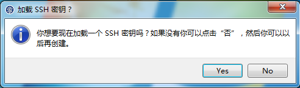
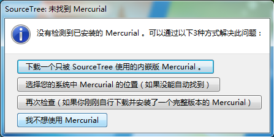
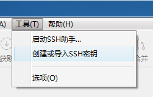
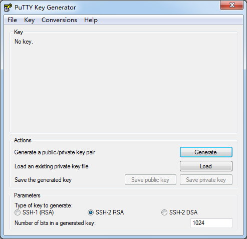
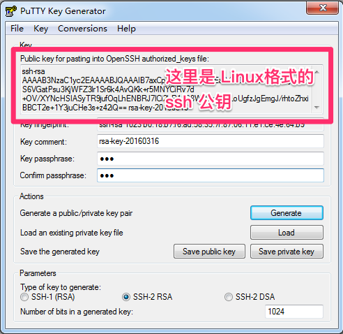
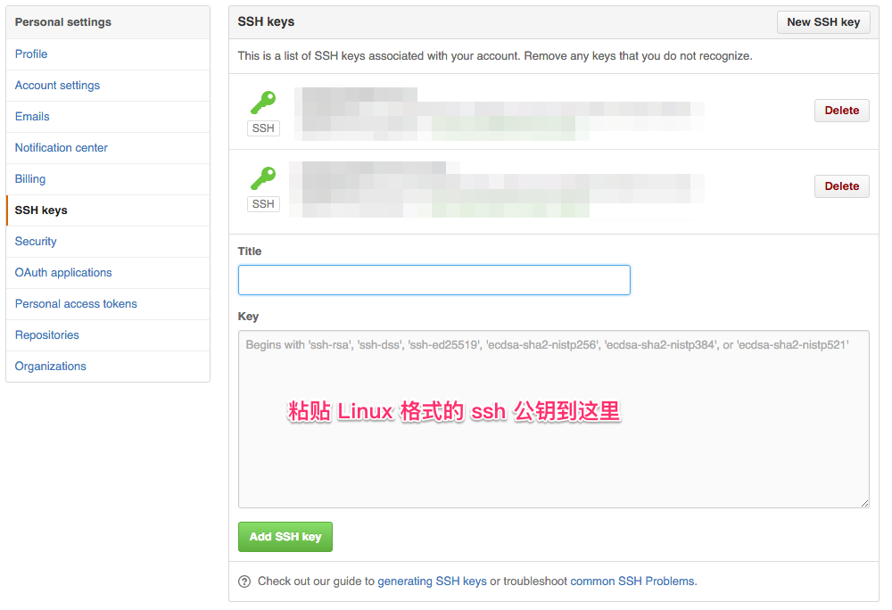
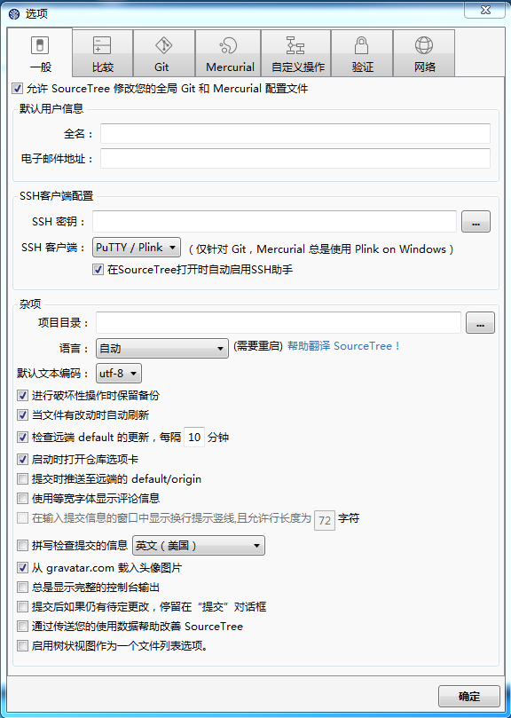

# 目录
* [git 安装](#git-安装)
    * [Linux 安装](#linux-安装)
    * [Windows 安装注意事项](#windows-安装注意事项)
* [git GUI 程序](#git-gui-程序)
    * [Windows 下 sourcetree 配置](#windows-下-sourcetree-配置)
* [配置 SSH 密钥](#配置-ssh-密钥)
    * [Linux 或 Mac 系统下配置密钥](#linux-或-mac-系统下配置密钥)
    * [Windows 下配置密钥](#windows-下配置密钥)
* [添加 SSH 公钥到服务器](#添加-ssh-公钥到服务器)
* [sourcetree 设置](#sourcetree-设置)
    * [Windows 下需要的特殊设置](#windows-下需要的特殊设置)

# git 安装
Linux直接可以用包管理器下载安装, Mac/Windows 可以到[官网](https://git-scm.com/download/)下载后安装
### Linux 安装
基本各个 Linux 都有各自的包管理工具,   
这里以 ubuntu 下举例, 在终端运行:
```bash
sudo apt-get install git
```

### Windows 安装注意事项


这里三个选项是针对 windows 的换行符的处理

1. 下载时自动转换为 windows 的模式(CRLF), 上传时转换为 Unix 的模式(LF)
2. 下载原始文件, 但上传为 Unix 的模式
3. 下载原始文件, 上传原始文件

一般建议选第二个以便跨平台协作

# git GUI 程序
个人推荐使用 [sourcetree](https://www.sourcetreeapp.com/), 目前有 Mac 版和 Windows 版, Linux 下也有许多开源的替代品

安装后需要注册才能使用, 注册是免费的

### Windows 下 sourcetree 配置
首次运行会显示, 可以直接点否



这里可以选`我不想使用 Mercuial`, Mercuial 是另一个 sourcetree 支持的版本管理工具, 这里我们只使用 git



# 配置 SSH 密钥
### Linux 或 Mac 系统下配置密钥
在终端运行:
```bash
ssh-keygen -t rsa -b 4096 -C "your_email@example.com"
```
会提示密钥保存的名称和路径, 默认即可
```
Enter a file in which to save the key (/Users/you/.ssh/id_rsa): [按回车]
```
会提示输入密钥的密码, 这个密码以后每次使用密钥时都需要输入
```
Enter passphrase (empty for no passphrase): [输入密码]
Enter same passphrase again: [再次输入密码]
```
### Windows 下配置密钥


打开程序后, 首先需要设置 ssh 密钥(ssh-key), 这个是 git 程序上传文件是使用的"授权文件",   
原生的 git 是没有"用户名"和"密码"的, 和服务器沟通时就靠这个文件确认是否有读写权限



这里点击`Generate`生成一个新的 ssh 密钥, 生成时需要不断的晃动鼠标以增加随机数, 直到进度条满了位置,



生成完毕后, 可以在`Key passphras`里输入当前密钥的开启密码, 以后加载使用该密钥是都需要输入

点击`Save public key`和`Save private key` 保存公钥和私钥,   
并且把`Key fingerprint`上方输入框内的类似乱码的东西也要保存起来, 这个是 Linux 系统使用的 ssh-key 格式,   
而`Save public key`里保存的是 Windows 下 ssh 软件 PuTTY 所使用的格式,两者格式不相同但可以互相转换.  
因为大多的 git 服务程序都是运行在 Linux 下, 所以需要把 Linux 格式的 ssh-key 上传到服务器.

# 添加 SSH 公钥到服务器
例如在 github 上添加:  


# sourcetree 设置


默认用户信息里的`全名`和`电子邮件地址`并不做登录用途, 只是 commit 时用来标记身份而已,可随意更改
### Windows 下需要的特殊设置
`SSH 密钥`位置可以把刚才生成的私钥文(ppk格式)件添加上去,   
这样 sourcetree 每次打开时就会自动加载而不需要再次手动选择了
